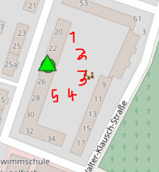
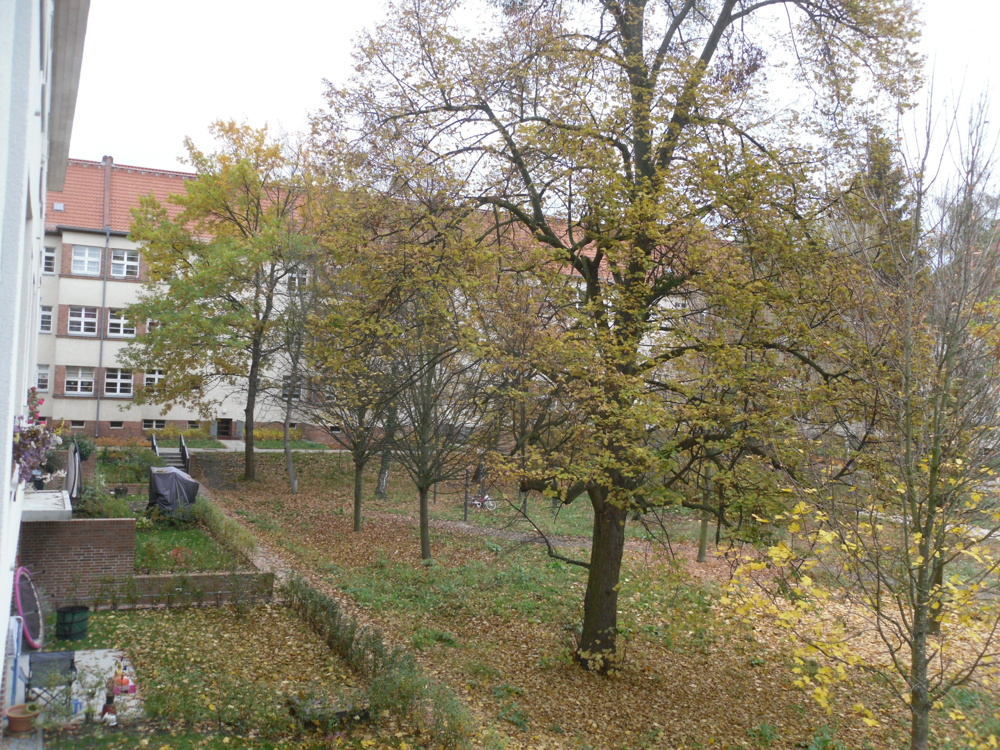
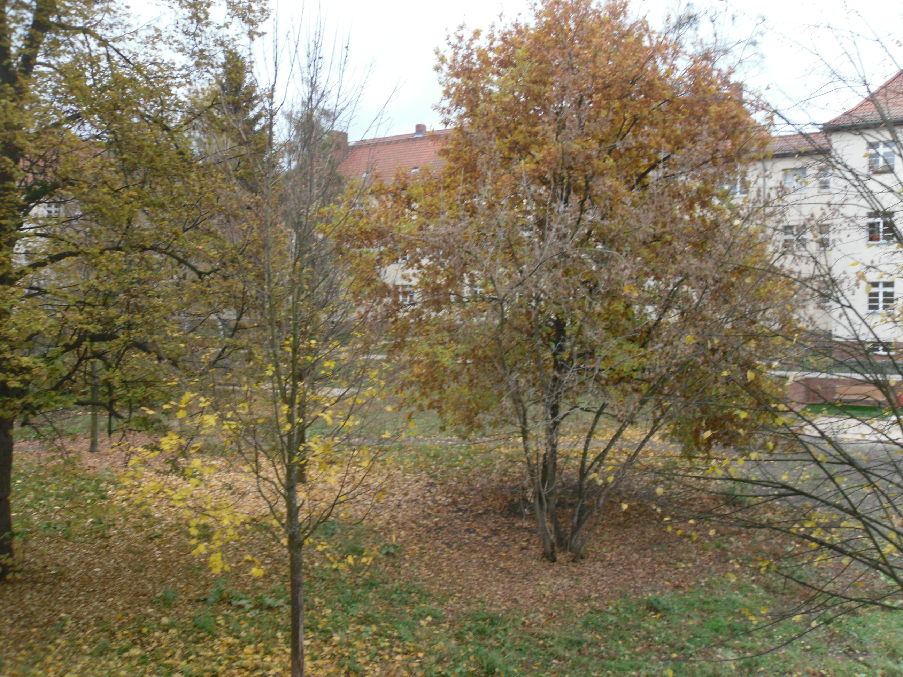
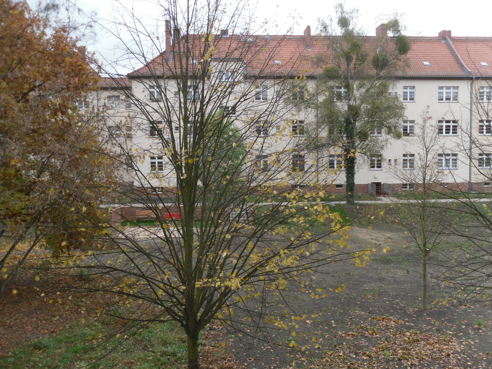
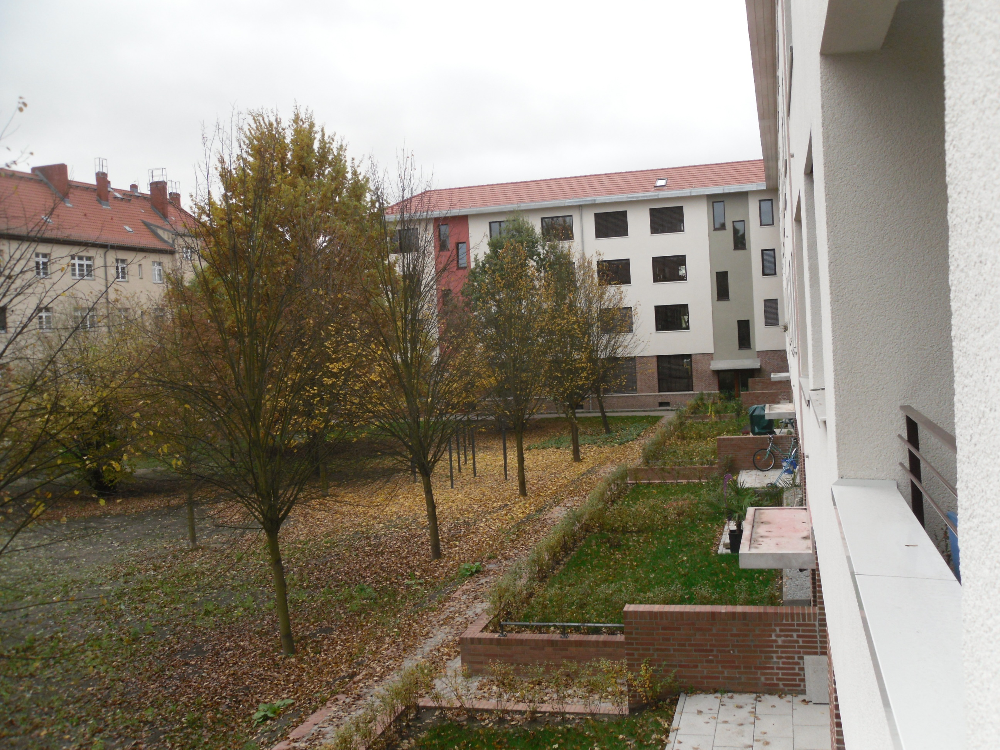

Fotos von der Heinrich-von-Kleist-Strafle 24 f¸r Freifunker zum Meshen
=====================================================================

Um mit anderen Freifunkern zu Meshen, ist es hilfreich, herauszufinden, ob man Sichtkontakt hat.

Heinrich-von-Kleist-Strafle 24
-----------------------------

Diese Fotos wurden zur Strafle hin gemacht.

Hinterhof
---------

Das sind Fotos vom Hinterhof.

